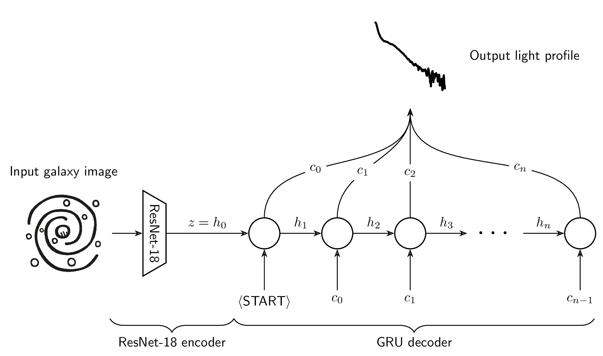
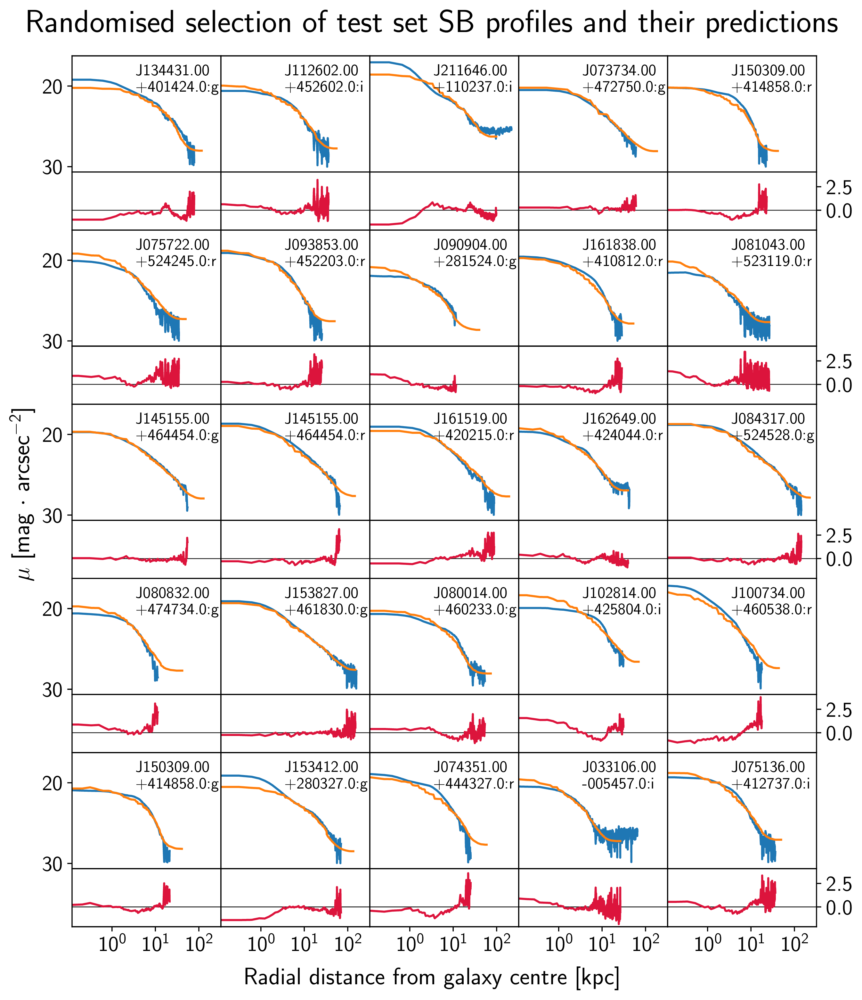
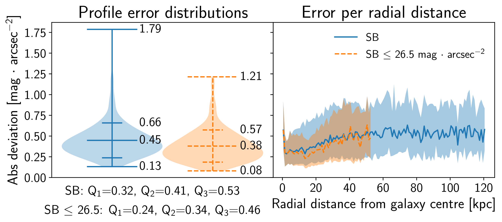

# Pix2Prof: deep learning for the extraction of useful sequential information from galaxy imagery



This repository is the official implementation of
[Pix2Prof](https://arxiv.org/abs/2010.00622). 

The paper is available at the link above, or [here](docs/pix2prof.pdf).

The model as trained produces a surface brightness profile from an unprocessed
galaxy image from the SDSS in either the g, r, or i bands. With a throughput
speed of ~ 1 galaxy/second on an Intel Xeon E5-2650 v3 CPU, Pix2Prof improves
on the speed of [the method it approximates](https://doi.org/10.1086/192281) by
over two orders of magnitude! 

Also, given suitable training data, Pix2Prof can be retrained to produce any galaxy
profile from any galaxy image.

## Requirements

To install requirements:

```setup
pip install -r requirements.txt
```

## Training

To train Pix2Prof, run this command:

```train
python train.py --gals ./gals.txt
```

Where ``gals.txt`` is a textfile containing a list of galaxy names.

## Evaluation

To evaluate Pix2Prof, run:

```eval
python eval.py ./gals.txt <checkpoint_location>
```

Where ``gals.txt`` is a textfile listing a list of galaxy names.

## Pre-trained Models

You can download the pretrained model used in the paper here:

[](https://doi.org/10.5281/zenodo.4072941)

If you want to use the pretrained model to infer your dataset, download the
checkpoint to your working directory and run:

```eval_ckpt
python eval.py ./gals.txt pix2prof_2020-10-08.pth
```

Where ``gals.txt`` is a textfile listing a list of galaxy names.

## Results

Here is a random selection of predictions from the test set:



Here is the summary statistics plot from the paper:



## Contributing

Pix2Prof is free software: you can redistribute it and/or modify it under the
terms of the GNU Affero General Public License as published by the Free
Software Foundation, either version 3 of the License, or (at your option) any
later version.

Pix2Prof is distributed in the hope that it will be useful, but WITHOUT ANY
WARRANTY; without even the implied warranty of MERCHANTABILITY or FITNESS FOR A
PARTICULAR PURPOSE.  See the GNU Affero General Public License for more
details.

You should have received a copy of the GNU Affero General Public License along
with Pix2Prof.  If not, see <https://www.gnu.org/licenses/>.
